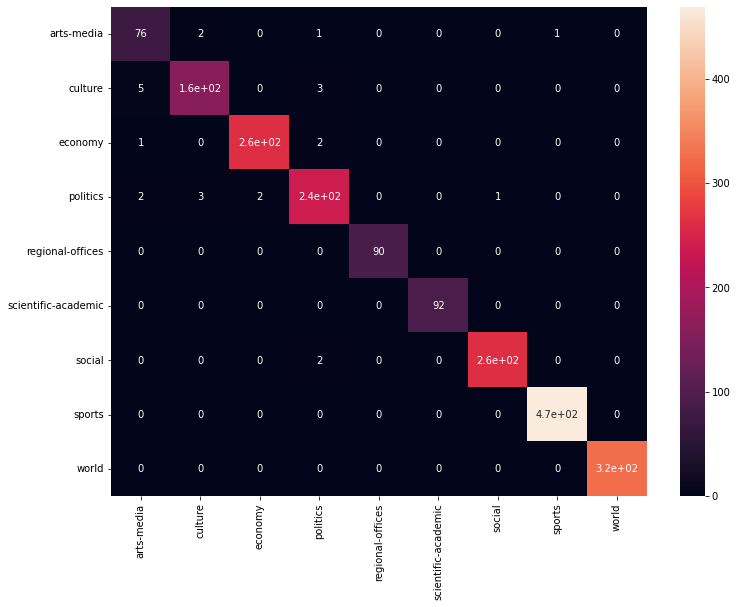
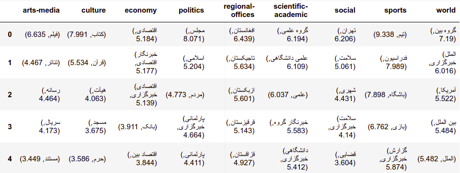

# News-Category-Keywords
**Simultaneously Classifying News Categories and Extract Keywords** This project is bulit to learn classifiers to automatically classify news categories give their text and title. Three methods have been tested:
  - Logistic Regression
  - LSTM
  - Transformer

The confusion matrix of test set is shown below:

Further, we have extracted the important words for each category using the weights of Logistic Regression's weights, which is depicted in the below figure.

